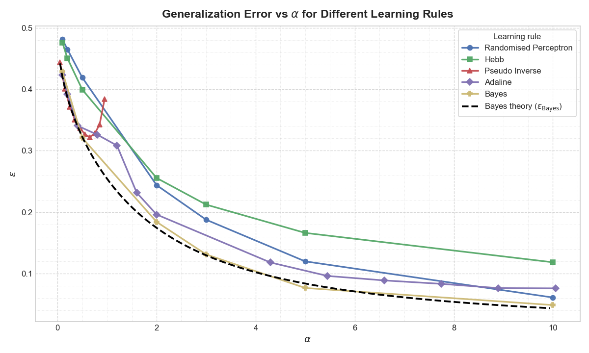

# Perceptron

A minimal C++17 library for single-layer perceptron experiments in the teacher-student framework. Supports Hebb, Perceptron, RandomPerceptron, and Adaline learning rules on bipolar (±1) data.

## Classes

### `RandBinary`

A single bipolar random vector of length `L` with ±1 entries.

```cpp
RandBinary(int L);                        // random ±1 vector
RandBinary(const vector<int>& seq);       // from explicit sequence
const vector<int>& getSequence() const;
```

### `RandBinaryDataset`

A dataset of `P` random bipolar input vectors paired with labels.

```cpp
RandBinaryDataset(int P, int L);                          // random ±1 labels
RandBinaryDataset(int P, int L, const Perceptron& teacher); // labels from teacher
const vector<RandBinary>& getData() const;
const vector<int>&        getLabels() const;
int   countErrors(const vector<int>& predictions) const;
void  shuffle();
int   size() const;
```

### `Perceptron`

A single-layer perceptron with Gaussian-initialised weights.

```cpp
Perceptron(int L);                          // random N(0,1) weights
Perceptron(const vector<double>& weights);  // explicit weights (teacher)

double apply(const RandBinary& x) const;    // raw dot product w·x
int    testOnDataset(const RandBinaryDataset& ds) const;  // error count
double calcCost(const RandBinaryDataset& ds) const;       // mean squared error

Perceptron& trainOnDataset(RandBinaryDataset& ds, const string& rule, double variance = 50.0);
```

**Supported `rule` strings:**

| Rule | Description |
|---|---|
| `"Hebb"` | One-shot Hebbian update: `w += (1/√L) y^μ x^μ` |
| `"Perceptron"` | Online perceptron rule, runs until zero training error |
| `"RandomPerceptron"` | Perceptron rule with Gaussian noise on each update |
| `"Adaline"` | Hebbian init → gradient descent on MSE until convergence |

## Compilation

Include all six source files in your build command — no separate compilation step is required:

```bash
g++ -std=c++17 -Ipath/to/perceptron \
    your_program.cpp \
    path/to/perceptron/Perceptron.cc \
    path/to/perceptron/RandBinary.cc \
    path/to/perceptron/RandBinaryDataset.cc \
    -o your_program
```

The `-I` flag lets `#include "Perceptron.h"` resolve without path prefixes in your source.

## Usage example

```cpp
#include "Perceptron.h"
#include "RandBinaryDataset.h"

int main() {
    int L = 100;  // input dimension
    int P = 50;   // training examples

    // Teacher with random weights generates the labels
    Perceptron teacher(L);
    RandBinaryDataset dataset(P, L, teacher);

    // Train a student perceptron with the Hebb rule
    Perceptron student(L);
    student.trainOnDataset(dataset, "Hebb");

    // Evaluate on the training set
    int errors = student.testOnDataset(dataset);
    double error_rate = static_cast<double>(errors) / P;
}
```

## Examples

The `examples/` folder contains solution writeups showing how this library is used in practice:

- `Exc03_Passante.pdf` — training error as a function of dataset size `P/L` (Hebb rule)
- `Exc06_Passante.pdf` — comparison of all four learning rules
- `Exc07_Passante.pdf` — pseudo-inverse rule and Bayes-optimal generalisation bound

Generalisation error ε as a function of α = P/L for all supported learning rules, benchmarked against the Bayes-optimal bound:


